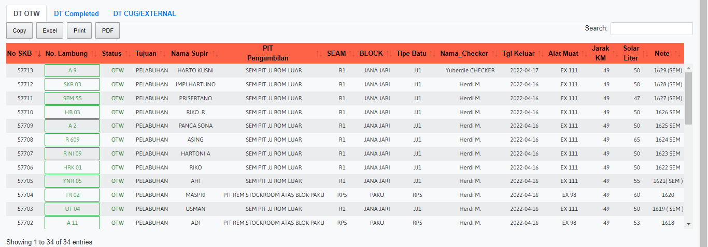
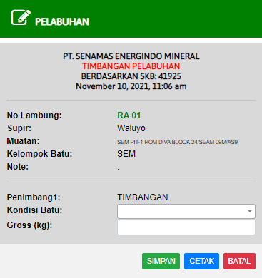
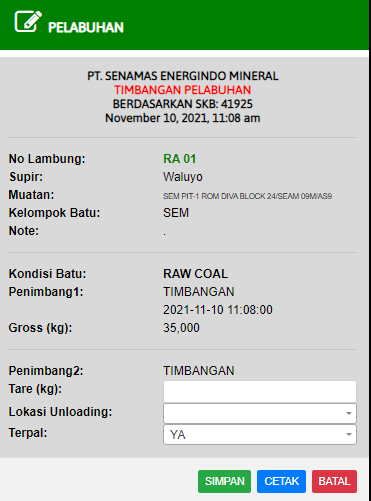

# DT OTW

### DT OTW

DT OTW adalah tabel yang menginformasikan keberangkatan truk pengiriman batubara. Jika terjadi kesalahan dalam pengiriman, klik No. Lambung untuk memperbaiki kesalahan dalam pengiriman

### TIMBANGAN 1

Form ini digunakan ketika truk sampai di pelabuhan, truk harus melakukan penimbangan. Masukan kondisi batu dan gross (RAW COAL)/berat kotor dalam satuan (kg) dari penimbangan tersebut.

### TIMBANGAN 2

Form ini digunakan Ketika truk sudah selesai unloading, truk melakukan penimbangan kembali. Masukan informasi Tare/berat bersih dalam satuan (kg), lokasi unloading (GEA,HAJI-MILYAR,HR,SEM,SEM-1,SEM-V,YERTI), dan terpal diharuskan untuk tertutup.
